# Program Register API 플로우 다이어그램

## API 엔드포인트
```
POST /v1/programs/register
```

## 요청 파라미터
- `ladder_zip`: UploadFile (PLC ladder logic ZIP 파일)
- `classification_xlsx`: UploadFile (템플릿 분류체계 데이터 XLSX 파일)
- `device_comment_csv`: UploadFile (Device 설명 CSV 파일)
- `program_title`: str (프로그램 제목)
- `program_description`: Optional[str] (프로그램 설명)
- `user_id`: str (사용자 ID, 기본값: "user")

## 전체 플로우 다이어그램

```mermaid
flowchart TD
    Start([클라이언트 요청<br/>POST /v1/programs/register]) --> Router[program_router.py<br/>register_program]
    
    Router --> Service[program_service.py<br/>ProgramService.register_program]
    
    Service --> GenID[program_id 생성<br/>gen]
    
    GenID --> Validate[ProgramValidator<br/>validate_files]
    
    Validate --> ValidateZIP[ZIP 파일 검증<br/>_validate_zip_file]
    Validate --> ValidateXLSX[XLSX 파일 검증<br/>_validate_xlsx_file]
    Validate --> ValidateCSV[CSV 파일 검증<br/>_validate_csv_file]
    Validate --> CrossRef[교차 검증<br/>XLSX 로직파일명이 ZIP에 있는지 확인]
    
    ValidateZIP --> CheckResult{검증 결과}
    ValidateXLSX --> CheckResult
    ValidateCSV --> CheckResult
    CrossRef --> CheckResult
    
    CheckResult -->|검증 실패| ReturnError[즉시 응답 반환<br/>validation_failed]
    ReturnError --> End1([응답 반환])
    
    CheckResult -->|검증 통과| CreateProgram[ProgramCRUD<br/>create_program<br/>status: PROCESSING]
    
    CreateProgram --> Commit1[DB Commit]
    Commit1 --> AsyncTask[비동기 태스크 생성<br/>_process_program_async]
    
    AsyncTask --> ReturnSuccess[즉시 응답 반환<br/>status: processing]
    ReturnSuccess --> End2([응답 반환])
    
    AsyncTask -.->|백그라운드 처리| AsyncFlow
    
    subgraph AsyncFlow[비동기 처리 플로우]
        AsyncStart[비동기 처리 시작] --> S3Upload[ProgramUploader<br/>upload_and_unzip]
        
        S3Upload --> UploadZIP[ZIP 파일 S3 업로드]
        S3Upload --> Unzip[ZIP 압축 해제<br/>S3에 저장]
        S3Upload --> UploadXLSX[XLSX 파일 S3 업로드]
        S3Upload --> UploadCSV[CSV 파일 S3 업로드]
        
        UploadZIP --> UpdateS3Paths[ProgramCRUD<br/>update_program_s3_paths]
        Unzip --> UpdateS3Paths
        UploadXLSX --> UpdateS3Paths
        UploadCSV --> UpdateS3Paths
        
        UpdateS3Paths --> Commit2[DB Commit]
        
        Commit2 --> Preprocess[ProgramUploader<br/>preprocess_and_create_json]
        
        Preprocess --> ProcessJSON[JSON 파일 생성<br/>각 ladder 파일을 JSON으로 변환]
        ProcessJSON --> UploadJSON[JSON 파일 S3 업로드]
        
        UploadJSON --> CheckPreprocess{전처리 결과}
        
        CheckPreprocess -->|실패 파일 있음| SaveFailures1[ProcessingFailureCRUD<br/>전처리 실패 정보 저장]
        SaveFailures1 --> CreateDocuments
        CheckPreprocess -->|모두 성공| CreateDocuments[DocumentCRUD<br/>create_document<br/>각 JSON 파일을 Document로 저장]
        
        CreateDocuments --> ChunkCommit{50개마다<br/>청크 Commit}
        ChunkCommit -->|진행 중| CreateDocuments
        ChunkCommit -->|완료| CheckDocuments{Document 저장 결과}
        
        CheckDocuments -->|실패 파일 있음| SaveFailures2[ProcessingFailureCRUD<br/>Document 저장 실패 정보 저장]
        SaveFailures2 --> UpdateMetadata
        CheckDocuments -->|모두 성공| UpdateMetadata[ProgramCRUD<br/>update_program<br/>메타데이터 업데이트]
        
        UpdateMetadata --> Commit3[DB Commit]
        
        Commit3 --> CreateJob[ProcessingJobCRUD<br/>create_job<br/>job_type: vector_indexing]
        
        CreateJob --> Commit4[DB Commit]
        
        Commit4 --> VectorIndex[ProgramUploader<br/>request_vector_indexing]
        
        VectorIndex --> CheckIndex{인덱싱 결과}
        
        CheckIndex -->|성공| UpdateJobSuccess[ProcessingJobCRUD<br/>update_job_status: completed]
        UpdateJobSuccess --> UpdateProgramSuccess[ProgramCRUD<br/>update_program_status: COMPLETED<br/>update_program_vector_info]
        UpdateProgramSuccess --> Commit5[DB Commit]
        Commit5 --> AsyncEnd1([비동기 처리 완료])
        
        CheckIndex -->|실패| UpdateJobFail[ProcessingJobCRUD<br/>update_job_status: failed]
        UpdateJobFail --> UpdateProgramFail[ProgramCRUD<br/>update_program_status: INDEXING_FAILED]
        UpdateProgramFail --> Commit6[DB Commit]
        Commit6 --> AsyncEnd2([비동기 처리 완료<br/>실패])
        
        CheckIndex -->|예외 발생| UpdateJobError[ProcessingJobCRUD<br/>update_job_status: failed<br/>error_message 저장]
        UpdateJobError --> UpdateProgramError[ProgramCRUD<br/>update_program_status: INDEXING_FAILED]
        UpdateProgramError --> Commit7[DB Commit]
        Commit7 --> AsyncEnd3([비동기 처리 완료<br/>오류])
    end
    
    style Start fill:#e1f5ff
    style End1 fill:#ffe1e1
    style End2 fill:#e1ffe1
    style AsyncEnd1 fill:#e1ffe1
    style AsyncEnd2 fill:#fff4e1
    style AsyncEnd3 fill:#ffe1e1
    style CheckResult fill:#fff9e1
    style CheckPreprocess fill:#fff9e1
    style CheckDocuments fill:#fff9e1
    style CheckIndex fill:#fff9e1
```



## 단계별 상세 설명

### 1. 요청 수신 및 라우팅
- **파일**: `ai_backend/src/api/routers/program_router.py`
- **함수**: `register_program()`
- **역할**: FastAPI 라우터에서 요청을 받아 `ProgramService`로 전달

### 2. 프로그램 ID 생성
- **함수**: `gen()` (UUID 생성)
- **역할**: 고유한 `program_id` 생성

### 3. 파일 유효성 검사 (동기)
- **파일**: `ai_backend/src/api/services/program_validator.py`
- **클래스**: `ProgramValidator`
- **검증 항목**:
  - ZIP 파일 형식 및 내용 확인
  - XLSX 파일 형식 및 필수 컬럼 확인 (`로직파일명`, `분류`, `템플릿명`)
  - CSV 파일 형식 및 필수 컬럼 확인 (`파일명`, `디바이스명`, `설명`)
  - XLSX의 로직파일명이 ZIP 파일에 실제로 존재하는지 교차 검증

### 4. 검증 실패 시
- 즉시 응답 반환 (DB 저장하지 않음)
- 응답: `status: "validation_failed"`, `errors`, `warnings` 포함

### 5. 검증 통과 시
- **Program 테이블에 메타데이터 저장** (동기)
  - `status`: `PROCESSING`
  - `program_id`, `program_title`, `program_description`, `user_id` 저장
- **DB Commit**

### 6. 비동기 처리 시작
- `asyncio.create_task()`로 백그라운드 태스크 생성
- 즉시 응답 반환 (`status: "processing"`)

### 7. 비동기 처리 플로우

#### 7.1 S3 업로드 및 압축 해제
- **파일**: `ai_backend/src/api/services/program_uploader.py`
- **함수**: `upload_and_unzip()`
- **작업**:
  - ZIP 파일 S3 업로드: `programs/{program_id}/ladder_logic.zip`
  - ZIP 압축 해제 후 S3에 저장: `programs/{program_id}/unzipped/`
  - XLSX 파일 S3 업로드: `programs/{program_id}/classification.xlsx`
  - CSV 파일 S3 업로드: `programs/{program_id}/device_comment.csv`
- **S3 경로를 Program 테이블에 저장**

#### 7.2 전처리 및 JSON 생성
- **함수**: `preprocess_and_create_json()`
- **작업**:
  - 압축 해제된 각 ladder 파일을 JSON으로 변환
  - 분류체계 데이터(XLSX)와 Device 설명(CSV)을 결합
  - JSON 파일을 S3에 업로드
- **실패 파일은 ProcessingFailure 테이블에 저장**

#### 7.3 Document 테이블 저장
- **각 JSON 파일을 Document 테이블에 저장**
- **청크 단위 Commit**: 50개마다 commit (성능 최적화)
- **실패 파일은 ProcessingFailure 테이블에 저장**

#### 7.4 메타데이터 업데이트
- **Program.metadata_json에 처리 통계 저장**:
  - `total_expected`: 예상 파일 수
  - `total_successful_documents`: 성공한 Document 수
  - `has_partial_failure`: 부분 실패 여부
  - `preprocessing_summary`: 전처리 요약
  - `document_storage_summary`: Document 저장 요약

#### 7.5 Vector DB 인덱싱
- **ProcessingJob 테이블에 작업 생성**
  - `job_type`: `"vector_indexing"`
  - `doc_id`: `program_id`
- **Vector DB 인덱싱 요청**
- **결과에 따라 상태 업데이트**:
  - 성공: `Program.status = COMPLETED`, `vector_indexed = True`
  - 실패: `Program.status = INDEXING_FAILED`

## 데이터베이스 테이블 변경 사항

### Program 테이블
- `status`: `PREPARING` → `PROCESSING` → `COMPLETED` / `INDEXING_FAILED` / `FAILED`
- `metadata_json`: 처리 통계 및 메타데이터 저장
- S3 경로 정보 저장

### Document 테이블
- 각 JSON 파일이 하나의 Document로 저장
- `program_id`: Program과 연결
- `metadata_json`: 원본 파일 정보 및 처리 단계 정보

### ProcessingJob 테이블
- Vector 인덱싱 작업 정보 저장
- `status`: `pending` → `processing` → `completed` / `failed`

### ProcessingFailure 테이블
- 전처리 실패 정보 저장 (`FAILURE_TYPE_PREPROCESSING`)
- Document 저장 실패 정보 저장 (`FAILURE_TYPE_DOCUMENT_STORAGE`)
- 재시도 가능한 실패 정보 관리

## 에러 처리

1. **검증 실패**: 즉시 응답 반환, DB 저장하지 않음
2. **전처리 실패**: `ProcessingFailure` 테이블에 저장, 나머지 파일 계속 처리
3. **Document 저장 실패**: `ProcessingFailure` 테이블에 저장, 나머지 파일 계속 처리
4. **Vector 인덱싱 실패**: `Program.status = INDEXING_FAILED`, `ProcessingJob.status = failed`
5. **예외 발생**: `Program.status = FAILED`, `error_message` 저장

## 응답 형식

### 성공 응답 (검증 통과)
```json
{
  "status": "success",
  "message": "유효성 검사를 통과했습니다. 파일 처리가 진행 중입니다.",
  "data": {
    "program_id": "...",
    "program_title": "...",
    "status": "processing",
    "is_valid": true,
    "errors": [],
    "warnings": [...],
    "checked_files": [...]
  },
  "validation_result": {
    "is_valid": true,
    "errors": [],
    "warnings": [...],
    "checked_files": [...]
  }
}
```

### 실패 응답 (검증 실패)
```json
{
  "status": "validation_failed",
  "message": "유효성 검사를 통과하지 못했습니다.",
  "data": null,
  "validation_result": {
    "is_valid": false,
    "errors": [...],
    "warnings": [...],
    "checked_files": [...]
  }
}
```

