# 전체 데이터베이스 ERD (Entity Relationship Diagram)

## 개요

이 문서는 프로젝트의 모든 데이터베이스 테이블과 그 관계를 Mermaid ERD 다이어그램으로 표현합니다.

---

## ERD 다이어그램

```mermaid
erDiagram
    %% ============ Program 관련 테이블 ============
    PROGRAMS {
        string PROGRAM_ID PK "프로그램 ID"
        string PROGRAM_NAME "프로그램 이름"
        text DESCRIPTION "설명"
        datetime CREATE_DT "생성일시"
        string CREATE_USER "생성 사용자"
        datetime UPDATE_DT "수정일시"
        string UPDATE_USER "수정 사용자"
        string STATUS "상태 (preparing, uploading, processing, embedding, completed, failed)"
        text ERROR_MESSAGE "에러 메시지"
        datetime COMPLETED_AT "완료일시"
        boolean IS_USED "사용 여부"
    }
    
    DOCUMENTS {
        string DOCUMENT_ID PK "문서 ID"
        string DOCUMENT_NAME "문서명"
        string ORIGINAL_FILENAME "원본 파일명"
        string FILE_KEY "파일 키 (S3)"
        integer FILE_SIZE "파일 크기"
        string FILE_TYPE "MIME 타입"
        string FILE_EXTENSION "확장자"
        string UPLOAD_PATH "업로드 경로"
        string FILE_HASH "파일 해시"
        string USER_ID "사용자 ID"
        boolean IS_PUBLIC "공개 여부"
        string DOCUMENT_TYPE "문서 타입 (common, type1, type2)"
        string STATUS "상태"
        integer TOTAL_PAGES "총 페이지"
        integer PROCESSED_PAGES "처리된 페이지"
        string ERROR_MESSAGE "에러 메시지"
        string MILVUS_COLLECTION_NAME "Milvus 컬렉션명"
        integer VECTOR_COUNT "벡터 개수"
        string LANGUAGE "언어"
        string AUTHOR "작성자"
        string SUBJECT "주제"
        json METADATA_JSON "메타데이터"
        json PROCESSING_CONFIG "처리 설정"
        json PERMISSIONS "권한"
        datetime CREATE_DT "생성일시"
        datetime UPDATED_AT "수정일시"
        datetime PROCESSED_AT "처리일시"
        boolean IS_DELETED "삭제 여부"
        string PROGRAM_ID FK "프로그램 ID"
        string PROGRAM_FILE_TYPE "프로그램 파일 타입 (ladder_logic, comment, template, processed_json)"
        string SOURCE_DOCUMENT_ID FK "원본 문서 ID (자기 참조)"
        string KNOWLEDGE_REFERENCE_ID FK "Knowledge Reference ID"
    }
    
    DOCUMENT_CHUNKS {
        uuid ID PK "ID"
        string CHUNK_ID UK "청크 ID"
        string DOC_ID FK "문서 ID"
        integer PAGE_NUMBER "페이지 번호"
        string CHUNK_TYPE "청크 타입 (text, image, combined)"
        text CONTENT "내용"
        text IMAGE_DESCRIPTION "이미지 설명"
        string IMAGE_PATH "이미지 경로"
        string MILVUS_ID "Milvus ID"
        string EMBEDDING_MODEL "임베딩 모델"
        integer VECTOR_DIMENSION "벡터 차원"
        integer CHAR_COUNT "문자 수"
        integer WORD_COUNT "단어 수"
        string LANGUAGE "언어"
        json METADATA_JSON "메타데이터"
        datetime CREATED_AT "생성일시"
        datetime UPDATED_AT "수정일시"
    }
    
    PROCESSING_JOBS {
        uuid ID PK "ID"
        string JOB_ID UK "작업 ID"
        string DOC_ID "문서 ID (nullable=False)"
        string JOB_TYPE "작업 유형 (embedding, processing 등)"
        string STATUS "상태 (running, completed, failed)"
        string FLOW_RUN_ID "Prefect Flow Run ID"
        integer TOTAL_STEPS "총 단계"
        integer COMPLETED_STEPS "완료된 단계"
        string CURRENT_STEP "현재 단계"
        json RESULT_DATA "결과 데이터"
        text ERROR_MESSAGE "에러 메시지"
        datetime STARTED_AT "시작일시"
        datetime COMPLETED_AT "완료일시"
        datetime UPDATED_AT "수정일시"
        string PROGRAM_ID FK "프로그램 ID"
    }
    
    PROCESSING_FAILURES {
        string FAILURE_ID PK "실패 ID"
        string PROGRAM_ID FK "프로그램 ID"
        string FAILURE_TYPE "실패 타입 (preprocessing, document_storage, vector_indexing)"
        string FILE_PATH "파일 경로"
        integer FILE_INDEX "파일 인덱스"
        string FILENAME "파일명"
        string S3_PATH "S3 경로"
        string S3_KEY "S3 키"
        text ERROR_MESSAGE "에러 메시지"
        json ERROR_DETAILS "상세 에러 정보"
        integer RETRY_COUNT "재시도 횟수"
        integer MAX_RETRY_COUNT "최대 재시도 횟수"
        string STATUS "상태 (pending, retrying, resolved, failed)"
        datetime RESOLVED_AT "해결일시"
        datetime LAST_RETRY_AT "마지막 재시도일시"
        string RESOLVED_BY "해결자 (manual, auto, scheduled)"
        json METADATA_JSON "메타데이터"
        datetime CREATED_AT "생성일시"
        datetime UPDATED_AT "수정일시"
    }
    
    PROGRAM_LLM_DATA_CHUNKS {
        string CHUNK_ID PK "청크 ID"
        string PROGRAM_ID FK "프로그램 ID"
        string DATA_TYPE "데이터 타입 (prompt_config, context_data 등)"
        string DATA_VERSION "데이터 버전"
        integer CHUNK_INDEX "청크 순서 (0부터 시작)"
        integer TOTAL_CHUNKS "전체 청크 개수"
        integer CHUNK_SIZE "청크 크기 (bytes)"
        integer TOTAL_SIZE "전체 데이터 크기 (bytes)"
        string S3_BUCKET "S3 버킷"
        string S3_KEY "S3 키"
        string S3_URL "S3 URL"
        string FILE_HASH "파일 해시"
        string CHECKSUM "체크섬"
        text DESCRIPTION "설명"
        json METADATA_JSON "메타데이터"
        datetime CREATED_AT "생성일시"
        string CREATED_BY "생성자"
        datetime UPDATED_AT "수정일시"
        string UPDATED_BY "수정자"
    }
    
    %% ============ Knowledge Base 관련 테이블 ============
    KNOWLEDGE_REFERENCES {
        string REFERENCE_ID PK "참조 ID"
        string REFERENCE_TYPE "참조 타입 (manual, glossary, plc)"
        string NAME "이름"
        string VERSION "버전"
        boolean IS_LATEST "최신 버전 여부"
        string REPO_ID "레포 ID (필수)"
        string DATASOURCE_ID "데이터소스 ID (필수)"
        string FILE_ID "파일 ID (선택)"
        text DESCRIPTION "설명"
        boolean IS_ACTIVE "활성화 여부"
        json METADATA_JSON "메타데이터"
        datetime CREATED_AT "생성일시"
        string CREATED_BY "생성자"
        datetime UPDATED_AT "수정일시"
        string UPDATED_BY "수정자"
    }
    
    %% ============ Template 관련 테이블 ============
    TEMPLATES {
        string TEMPLATE_ID PK "템플릿 ID"
        string DOCUMENT_ID FK "문서 ID (템플릿 파일)"
        string PROGRAM_ID FK "프로그램 ID (선택)"
        json METADATA_JSON "메타데이터"
        datetime CREATED_AT "생성일시"
        string CREATED_BY "생성자"
    }
    
    TEMPLATE_DATA {
        string TEMPLATE_DATA_ID PK "템플릿 데이터 ID"
        string TEMPLATE_ID FK "템플릿 ID"
        string FOLDER_ID "폴더 ID"
        string FOLDER_NAME "폴더명"
        string SUB_FOLDER_NAME "하위 폴더명"
        string LOGIC_ID "로직 ID (예: 1100.csv)"
        string LOGIC_NAME "로직명"
        string DOCUMENT_ID FK "문서 ID (전처리된 JSON 파일)"
        integer ROW_INDEX "행 순서"
        json METADATA_JSON "메타데이터"
        datetime CREATED_AT "생성일시"
    }
    
    %% ============ 기준정보 마스터 테이블 ============
    PLANT_MASTER {
        string PLANT_ID PK "공장 ID"
        string PLANT_CODE "공장 코드 (unique, 시스템 자동 생성: P001, P002, ...)"
        string PLANT_NAME "공장명 (관리자 입력: BOSK KY, 전극, 조립 등)"
        text DESCRIPTION "설명"
        integer DISPLAY_ORDER "표시 순서"
        boolean IS_ACTIVE "활성화 여부"
        json METADATA_JSON "메타데이터"
        datetime CREATE_DT "생성일시"
        string CREATE_USER "생성 사용자"
        datetime UPDATE_DT "수정일시"
        string UPDATE_USER "수정 사용자"
    }
    
    PROCESS_MASTER {
        string PROCESS_ID PK "공정 ID"
        string PROCESS_CODE "공정 코드 (unique, 시스템 자동 생성: PRC-001, PRC-002, ...)"
        string PROCESS_NAME "공정명 (관리자 입력)"
        string PLANT_ID FK "공장 ID"
        text DESCRIPTION "설명"
        integer DISPLAY_ORDER "표시 순서"
        boolean IS_ACTIVE "활성화 여부"
        json METADATA_JSON "메타데이터"
        datetime CREATE_DT "생성일시"
        string CREATE_USER "생성 사용자"
        datetime UPDATE_DT "수정일시"
        string UPDATE_USER "수정 사용자"
    }
    
    LINE_MASTER {
        string LINE_ID PK "라인 ID"
        string LINE_CODE "라인 코드 (unique, 시스템 자동 생성: L001, L002, ...)"
        string LINE_NAME "라인명 (관리자 입력)"
        string PROCESS_ID FK "공정 ID"
        text DESCRIPTION "설명"
        integer DISPLAY_ORDER "표시 순서"
        boolean IS_ACTIVE "활성화 여부"
        json METADATA_JSON "메타데이터"
        datetime CREATE_DT "생성일시"
        string CREATE_USER "생성 사용자"
        datetime UPDATE_DT "수정일시"
        string UPDATE_USER "수정 사용자"
    }
    
    EQUIPMENT_GROUP_MASTER {
        string EQUIPMENT_GROUP_ID PK "장비 그룹 ID"
        string EQUIPMENT_GROUP_CODE "장비 그룹 코드 (unique, 시스템 자동 생성: EQ-001, EQ-002, ...)"
        string EQUIPMENT_GROUP_NAME "장비 그룹명 (관리자 입력)"
        string LINE_ID FK "라인 ID"
        text DESCRIPTION "설명"
        integer DISPLAY_ORDER "표시 순서"
        boolean IS_ACTIVE "활성화 여부"
        json METADATA_JSON "메타데이터"
        datetime CREATE_DT "생성일시"
        string CREATE_USER "생성 사용자"
        datetime UPDATE_DT "수정일시"
        string UPDATE_USER "수정 사용자"
    }
    
    %% ============ PLC 관련 테이블 ============
    PLC {
        string ID PK "Primary Key"
        string PLC_ID "PLC 식별자 (중복 가능)"
        string PLC_NAME "PLC 이름"
        string UNIT "유닛"
        string PROGRAM_ID FK "프로그램 ID (unique, PLC 1개 → Program 1개)"
        datetime MAPPING_DT "매핑 일시"
        string MAPPING_USER "매핑 사용자"
        boolean IS_ACTIVE "활성화 여부"
        json METADATA_JSON "메타데이터"
        datetime CREATE_DT "생성일시"
        string CREATE_USER "생성 사용자"
        datetime UPDATE_DT "수정일시"
        string UPDATE_USER "수정 사용자"
        %% 기준정보 스냅샷 (PLC 생성/수정 시점의 기준정보 저장)
        string PLANT_ID_SNAPSHOT "공장 ID 스냅샷 (생성 시점 기준정보)"
        string PLANT_CODE_SNAPSHOT "공장 코드 스냅샷"
        string PLANT_NAME_SNAPSHOT "공장명 스냅샷"
        string PROCESS_ID_SNAPSHOT "공정 ID 스냅샷"
        string PROCESS_CODE_SNAPSHOT "공정 코드 스냅샷"
        string PROCESS_NAME_SNAPSHOT "공정명 스냅샷"
        string LINE_ID_SNAPSHOT "라인 ID 스냅샷"
        string LINE_CODE_SNAPSHOT "라인 코드 스냅샷"
        string LINE_NAME_SNAPSHOT "라인명 스냅샷"
        string EQUIPMENT_GROUP_ID_SNAPSHOT "장비 그룹 ID 스냅샷"
        string EQUIPMENT_GROUP_CODE_SNAPSHOT "장비 그룹 코드 스냅샷"
        string EQUIPMENT_GROUP_NAME_SNAPSHOT "장비 그룹명 스냅샷"
        %% 현재 기준정보 참조 (선택 시 사용, nullable)
        string PLANT_ID_CURRENT FK "현재 공장 ID (nullable, 선택 시 사용)"
        string PROCESS_ID_CURRENT FK "현재 공정 ID (nullable, 선택 시 사용)"
        string LINE_ID_CURRENT FK "현재 라인 ID (nullable, 선택 시 사용)"
        string EQUIPMENT_GROUP_ID_CURRENT FK "현재 장비 그룹 ID (nullable, 선택 시 사용)"
    }
    
    %% ============ Chat 관련 테이블 ============
    CHATS {
        string CHAT_ID PK "채팅 ID"
        string CHAT_TITLE "채팅 제목"
        string USER_ID "사용자 ID"
        datetime CREATE_DT "생성일시"
        datetime LAST_MESSAGE_AT "마지막 메시지 시간"
        boolean IS_ACTIVE "활성화 여부"
        integer REVIEWER_COUNT "리뷰어 카운트"
    }
    
    CHAT_MESSAGES {
        string MESSAGE_ID PK "메시지 ID"
        string CHAT_ID FK "채팅 ID"
        string USER_ID "사용자 ID"
        text MESSAGE "메시지 내용"
        string MESSAGE_TYPE "메시지 타입 (text, image, file, assistant, user, cancelled)"
        string STATUS "상태 (generating, completed, cancelled, error)"
        datetime CREATE_DT "생성일시"
        boolean IS_DELETED "삭제 여부"
        boolean IS_CANCELLED "취소 여부"
        string PLC_ID FK "PLC ID (PLC 테이블의 ID)"
        json EXTERNAL_API_NODES "External API 노드 처리 결과"
    }
    
    MESSAGE_RATINGS {
        string RATING_ID PK "평가 ID"
        string MESSAGE_ID FK "메시지 ID (unique)"
        string USER_ID "사용자 ID"
        integer RATING_SCORE "평가 점수 (1-5점)"
        text RATING_COMMENT "평가 코멘트"
        datetime CREATE_DT "생성일시"
        datetime UPDATED_AT "수정일시"
        boolean IS_DELETED "삭제 여부"
    }
    
    %% ============ 관계 정의 ============
    %% Program 중심 관계
    PROGRAMS ||--o{ DOCUMENTS : "has (1:N)"
    PROGRAMS ||--o{ PROCESSING_JOBS : "has (1:N)"
    PROGRAMS ||--o{ PROCESSING_FAILURES : "has (1:N)"
    PROGRAMS ||--o{ PROGRAM_LLM_DATA_CHUNKS : "has (1:N)"
    PROGRAMS ||--o| TEMPLATES : "has (0:1)"
    PROGRAMS ||--|| PLC : "mapped_to (1:1, unique)"
    
    %% Document 중심 관계
    DOCUMENTS ||--o{ DOCUMENT_CHUNKS : "has (1:N)"
    DOCUMENTS ||--o{ PROCESSING_JOBS : "processed_by (1:N)"
    DOCUMENTS }o--|| DOCUMENTS : "source_document_id (자기 참조, ZIP → JSON)"
    DOCUMENTS }o--|| KNOWLEDGE_REFERENCES : "belongs_to (N:1)"
    
    %% Template 관계
    TEMPLATES }o--|| DOCUMENTS : "references (N:1, 템플릿 파일)"
    TEMPLATES ||--o{ TEMPLATE_DATA : "has (1:N)"
    TEMPLATE_DATA }o--|| DOCUMENTS : "references (N:1, 전처리된 JSON)"
    
    %% 기준정보 마스터 관계 (계층 구조)
    PLANT_MASTER ||--o{ PROCESS_MASTER : "has (1:N)"
    PROCESS_MASTER ||--o{ LINE_MASTER : "has (1:N)"
    LINE_MASTER ||--o{ EQUIPMENT_GROUP_MASTER : "has (1:N)"
    
    %% PLC와 기준정보 관계 (현재 기준정보 참조용, nullable)
    PLANT_MASTER ||--o{ PLC : "current_reference (1:N, nullable)"
    PROCESS_MASTER ||--o{ PLC : "current_reference (1:N, nullable)"
    LINE_MASTER ||--o{ PLC : "current_reference (1:N, nullable)"
    EQUIPMENT_GROUP_MASTER ||--o{ PLC : "current_reference (1:N, nullable)"
    
    %% Chat 관계
    CHATS ||--o{ CHAT_MESSAGES : "has (1:N)"
    CHAT_MESSAGES ||--|| MESSAGE_RATINGS : "rated_by (1:1, unique)"
    CHAT_MESSAGES }o--|| PLC : "linked_to (N:1)"
```



---

## 테이블별 설명

### 1. Program 관련 테이블

#### PROGRAMS
- **역할**: 프로그램 마스터 테이블
- **주요 필드**: `program_id`, `program_name`, `status`, `error_message`
- **상태 값**: `preparing`, `uploading`, `processing`, `embedding`, `completed`, `failed`

#### DOCUMENTS
- **역할**: 모든 문서의 메타정보 관리 (Program 파일, 전처리 JSON, 매뉴얼/용어집 파일 등)
- **주요 필드**: `document_id`, `program_id`, `program_file_type`, `knowledge_reference_id`, `source_document_id`
- **프로그램 파일 타입**: `ladder_logic`, `comment`, `template`, `processed_json`

#### DOCUMENT_CHUNKS
- **역할**: 문서의 청크 정보 (벡터화 대상)
- **주요 필드**: `chunk_id`, `doc_id`, `milvus_id`, `embedding_model`

#### PROCESSING_JOBS
- **역할**: 처리 작업 로그 (임베딩, 전처리 등)
- **주요 필드**: `job_id`, `doc_id`, `program_id`, `job_type`, `status`, `started_at`, `completed_at`
- **시간 정보**: `started_at` (시작 시간), `completed_at` (완료 시간, nullable)

#### PROCESSING_FAILURES
- **역할**: 처리 실패 정보 및 재시도 관리
- **주요 필드**: `failure_id`, `program_id`, `failure_type`, `status`, `retry_count`

#### PROGRAM_LLM_DATA_CHUNKS
- **역할**: Program LLM 데이터 청크 정보 (S3 분할 저장 메타정보)
- **주요 필드**: `chunk_id`, `program_id`, `data_type`, `data_version`, `s3_key`

### 2. Knowledge Base 관련 테이블

#### KNOWLEDGE_REFERENCES
- **역할**: Knowledge Base 참조 정보 마스터 (매뉴얼, 용어집, PLC 레포)
- **주요 필드**: `reference_id`, `reference_type`, `name`, `version`, `repo_id`, `datasource_id`
- **참조 타입**: `manual` (미쯔비시 매뉴얼), `glossary` (용어집), `plc` (PLC 레포)
- **용도**: 기준정보 조회 화면의 마스터 테이블

### 3. Template 관련 테이블

#### TEMPLATES
- **역할**: 템플릿 마스터 (Classification XLSX 파일 메타정보)
- **주요 필드**: `template_id`, `document_id`, `program_id`

#### TEMPLATE_DATA
- **역할**: 템플릿 상세 데이터 (템플릿 내 각 행의 데이터)
- **주요 필드**: `template_data_id`, `template_id`, `logic_id`, `logic_name`, `document_id`
- **관계**: `logic_id` (예: "1100.csv") → `document_id` (전처리된 "1100.json")

### 4. 기준정보 마스터 테이블

#### PLANT_MASTER
- **역할**: 공장 기준정보 마스터
- **주요 필드**: `plant_id` (PK), `plant_code` (unique), `plant_name`, `display_order`, `is_active`
- **용도**: 공장 기준정보 관리

#### PROCESS_MASTER
- **역할**: 공정 기준정보 마스터
- **주요 필드**: `process_id` (PK), `process_code` (unique), `process_name`, `plant_id` (FK), `display_order`, `is_active`
- **관계**: Process N:1 Plant
- **용도**: 공정 기준정보 관리

#### LINE_MASTER
- **역할**: 라인 기준정보 마스터
- **주요 필드**: `line_id` (PK), `line_code` (unique), `line_name`, `process_id` (FK), `display_order`, `is_active`
- **관계**: Line N:1 Process
- **용도**: 라인 기준정보 관리

#### EQUIPMENT_GROUP_MASTER
- **역할**: 장비 그룹 기준정보 마스터
- **주요 필드**: `equipment_group_id` (PK), `equipment_group_code` (unique), `equipment_group_name`, `line_id` (FK), `display_order`, `is_active`
- **관계**: Equipment Group N:1 Line
- **용도**: 장비 그룹 기준정보 관리

### 5. PLC 관련 테이블

#### PLC
- **역할**: PLC 기준 정보 및 Program 매핑 (기준정보 스냅샷 포함)
- **주요 필드**: 
  - 기본 정보: `id` (PK), `plc_id` (중복 가능), `plc_name`, `unit`, `program_id` (unique)
  - **기준정보 스냅샷** (PLC 생성/수정 시점의 기준정보 저장):
    - `plant_id_snapshot`, `plant_code_snapshot`, `plant_name_snapshot`
    - `process_id_snapshot`, `process_code_snapshot`, `process_name_snapshot`
    - `line_id_snapshot`, `line_code_snapshot`, `line_name_snapshot`
    - `equipment_group_id_snapshot`, `equipment_group_code_snapshot`, `equipment_group_name_snapshot`
  - **현재 기준정보 참조** (nullable, 선택 시 사용):
    - `plant_id_current` (FK), `process_id_current` (FK), `line_id_current` (FK), `equipment_group_id_current` (FK)
- **관계**: 
  - PLC 1개 → Program 1개 (unique 제약)
  - PLC N:1 Plant, Process, Line, Equipment Group (현재 기준정보 참조용, nullable)
- **용도**: 
  - PLC 정보 및 Program 매핑 관리
  - **채팅 히스토리**: 스냅샷 기준정보 사용 (예전 정보 유지)
  - **새로운 PLC 선택**: 현재 기준정보 마스터 사용
- **설명**: 
  - PLC 생성/수정 시점에 기준정보 마스터의 현재 값을 스냅샷으로 저장
  - 기준정보 마스터가 업데이트되어도 PLC의 스냅샷은 변경되지 않음
  - 채팅 메시지의 `plc_id`로 PLC를 참조하면, 해당 PLC의 스냅샷 기준정보를 사용

### 6. Chat 관련 테이블

#### CHATS
- **역할**: 채팅방 정보
- **주요 필드**: `chat_id`, `chat_title`, `user_id`, `reviewer_count`

#### CHAT_MESSAGES
- **역할**: 채팅 메시지
- **주요 필드**: `message_id`, `chat_id`, `message`, `message_type`, `status`, `plc_id`
- **PLC 연결**: `plc_id`로 PLC 테이블 참조

#### MESSAGE_RATINGS
- **역할**: 메시지 평가 (AI 답변에 대한 사용자 평가)
- **주요 필드**: `rating_id`, `message_id` (unique), `rating_score`, `rating_comment`

---

## 주요 관계 요약

### Program 중심 관계
- `PROGRAMS` 1:N `DOCUMENTS` (프로그램 파일들)
- `PROGRAMS` 1:N `PROCESSING_JOBS` (처리 작업들)
- `PROGRAMS` 1:N `PROCESSING_FAILURES` (실패 정보들)
- `PROGRAMS` 1:N `PROGRAM_LLM_DATA_CHUNKS` (LLM 데이터 청크들)
- `PROGRAMS` 0:1 `TEMPLATES` (템플릿)
- `PROGRAMS` 1:1 `PLC` (PLC 매핑, unique)

### Document 중심 관계
- `DOCUMENTS` 1:N `DOCUMENT_CHUNKS` (문서 청크들)
- `DOCUMENTS` 1:N `PROCESSING_JOBS` (처리 작업들)
- `DOCUMENTS` N:1 `DOCUMENTS` (자기 참조: ZIP → JSON)
- `DOCUMENTS` N:1 `KNOWLEDGE_REFERENCES` (Knowledge 참조)

### Template 관계
- `TEMPLATES` N:1 `DOCUMENTS` (템플릿 파일)
- `TEMPLATES` 1:N `TEMPLATE_DATA` (템플릿 상세 데이터)
- `TEMPLATE_DATA` N:1 `DOCUMENTS` (전처리된 JSON 파일)

### Chat 관계
- `CHATS` 1:N `CHAT_MESSAGES` (채팅 메시지들)
- `CHAT_MESSAGES` 1:1 `MESSAGE_RATINGS` (평가, unique)
- `CHAT_MESSAGES` N:1 `PLC` (PLC 연결)

---

## 기준정보 조회 화면용 마스터 테이블

### 1. 기준정보 마스터 테이블
- **PLANT_MASTER**: 공장 기준정보
- **PROCESS_MASTER**: 공정 기준정보 (Plant 하위)
- **LINE_MASTER**: 라인 기준정보 (Process 하위)
- **EQUIPMENT_GROUP_MASTER**: 장비 그룹 기준정보 (Line 하위)

### 2. PLC 기준정보
- **테이블**: `PLC`
- **조회 필드**: 
  - 기본: `plc_name`, `unit`
  - **스냅샷 기준정보**: `plant_name_snapshot`, `process_name_snapshot`, `line_name_snapshot`, `equipment_group_name_snapshot` (채팅 히스토리용)
  - **현재 기준정보**: `plant_id_current`, `process_id_current`, `line_id_current`, `equipment_group_id_current` (새로운 PLC 선택용)
- **설명**:
  - **채팅 히스토리**: PLC의 스냅샷 기준정보 사용 (생성 시점의 정보 유지)
  - **새로운 PLC 선택**: 현재 기준정보 마스터에서 조회하여 사용
  - 기준정보 마스터 업데이트 시, 기존 PLC의 스냅샷은 변경되지 않음

### 3. 미쯔비시 매뉴얼 & 용어집
- **테이블**: `KNOWLEDGE_REFERENCES`
- **조회 조건**: `reference_type IN ('manual', 'glossary')` AND `is_active = true`
- **조회 필드**: `name`, `version`, `is_latest`, `repo_id`, `datasource_id`, `description`

---

## 텍스트 기반 ERD

```
┌─────────────────────────────────────────────────────────────────────────────┐
│                           전체 데이터베이스 ERD                              │
└─────────────────────────────────────────────────────────────────────────────┘

┌─────────────────────────────────────────────────────────────────────────────┐
│ 1. Program 관련 테이블                                                       │
└─────────────────────────────────────────────────────────────────────────────┘

PROGRAMS (프로그램 마스터)
├─ PROGRAM_ID (PK) ──┐
├─ PROGRAM_NAME       │
├─ DESCRIPTION        │
├─ STATUS             │──┐
├─ ERROR_MESSAGE      │  │
├─ CREATE_DT          │  │
├─ CREATE_USER        │  │
├─ UPDATE_DT           │  │
├─ UPDATE_USER        │  │
├─ COMPLETED_AT       │  │
└─ IS_USED            │  │
                      │  │
                      │  │ 1:N
                      │  │
                      ▼  ▼
┌─────────────────────────────────────────────────────────────────────────────┐
DOCUMENTS (문서 메타정보)
├─ DOCUMENT_ID (PK) ────────────┐
├─ PROGRAM_ID (FK) ─────────────┼──→ PROGRAMS.PROGRAM_ID
├─ KNOWLEDGE_REFERENCE_ID (FK) ─┼──→ KNOWLEDGE_REFERENCES.REFERENCE_ID
├─ SOURCE_DOCUMENT_ID (FK) ─────┼──→ DOCUMENTS.DOCUMENT_ID (자기 참조)
├─ DOCUMENT_NAME                │
├─ PROGRAM_FILE_TYPE            │    (ladder_logic, comment, template, processed_json)
├─ FILE_KEY (S3)                │
├─ FILE_SIZE                     │
├─ STATUS                        │
├─ VECTOR_COUNT                  │
└─ ... (기타 필드)               │
                                 │
                                 │ 1:N
                                 │
                                 ▼
┌─────────────────────────────────────────────────────────────────────────────┐
DOCUMENT_CHUNKS (문서 청크)
├─ ID (PK)
├─ CHUNK_ID (UK)
├─ DOC_ID (FK) ──────────────────→ DOCUMENTS.DOCUMENT_ID
├─ MILVUS_ID
├─ EMBEDDING_MODEL
└─ ...

┌─────────────────────────────────────────────────────────────────────────────┐
PROCESSING_JOBS (처리 작업)
├─ ID (PK)
├─ JOB_ID (UK)
├─ DOC_ID ───────────────────────→ DOCUMENTS.DOCUMENT_ID
├─ PROGRAM_ID (FK) ───────────────→ PROGRAMS.PROGRAM_ID
├─ JOB_TYPE
├─ STATUS
├─ STARTED_AT (시작 시간)
├─ COMPLETED_AT (완료 시간, nullable)
└─ ...

┌─────────────────────────────────────────────────────────────────────────────┐
PROCESSING_FAILURES (처리 실패 정보)
├─ FAILURE_ID (PK)
├─ PROGRAM_ID (FK) ───────────────→ PROGRAMS.PROGRAM_ID
├─ FAILURE_TYPE
├─ STATUS
├─ RETRY_COUNT
└─ ...

┌─────────────────────────────────────────────────────────────────────────────┐
PROGRAM_LLM_DATA_CHUNKS (LLM 데이터 청크)
├─ CHUNK_ID (PK)
├─ PROGRAM_ID (FK) ───────────────→ PROGRAMS.PROGRAM_ID
├─ DATA_TYPE
├─ DATA_VERSION
├─ S3_KEY
└─ ...

┌─────────────────────────────────────────────────────────────────────────────┐
│ 2. Knowledge Base 관련 테이블                                               │
└─────────────────────────────────────────────────────────────────────────────┘

KNOWLEDGE_REFERENCES (Knowledge Base 참조 마스터)
├─ REFERENCE_ID (PK) ─────────────┐
├─ REFERENCE_TYPE                 │    (manual, glossary, plc)
├─ NAME                           │
├─ VERSION                        │
├─ IS_LATEST                      │
├─ REPO_ID                        │
├─ DATASOURCE_ID                 │
└─ ...                            │
                                  │
                                  │ 1:N
                                  │
                                  ▼
                            DOCUMENTS.KNOWLEDGE_REFERENCE_ID

┌─────────────────────────────────────────────────────────────────────────────┐
│ 3. Template 관련 테이블                                                     │
└─────────────────────────────────────────────────────────────────────────────┘

TEMPLATES (템플릿 마스터)
├─ TEMPLATE_ID (PK) ──────────────┐
├─ DOCUMENT_ID (FK) ──────────────┼──→ DOCUMENTS.DOCUMENT_ID
├─ PROGRAM_ID (FK) ───────────────┼──→ PROGRAMS.PROGRAM_ID (선택)
└─ ...                            │
                                  │
                                  │ 1:N
                                  │
                                  ▼
┌─────────────────────────────────────────────────────────────────────────────┐
TEMPLATE_DATA (템플릿 상세 데이터)
├─ TEMPLATE_DATA_ID (PK)
├─ TEMPLATE_ID (FK) ──────────────→ TEMPLATES.TEMPLATE_ID
├─ LOGIC_ID                       │    (예: "1100.csv")
├─ LOGIC_NAME                     │
├─ DOCUMENT_ID (FK) ──────────────┼──→ DOCUMENTS.DOCUMENT_ID
│                                 │    (전처리된 "1100.json")
└─ ...

┌─────────────────────────────────────────────────────────────────────────────┐
│ 4. 기준정보 마스터 테이블                                                   │
└─────────────────────────────────────────────────────────────────────────────┘

PLANT_MASTER (공장 기준정보)
├─ PLANT_ID (PK)
├─ PLANT_CODE (UNIQUE)            │
├─ PLANT_NAME                     │
├─ DESCRIPTION                    │
├─ DISPLAY_ORDER                  │
├─ IS_ACTIVE                      │
└─ ...

PROCESS_MASTER (공정 기준정보)
├─ PROCESS_ID (PK)
├─ PROCESS_CODE (UNIQUE)           │
├─ PROCESS_NAME                   │
├─ PLANT_ID (FK) ─────────────────┼──→ PLANT_MASTER.PLANT_ID
├─ DESCRIPTION                    │
├─ DISPLAY_ORDER                  │
├─ IS_ACTIVE                      │
└─ ...

LINE_MASTER (라인 기준정보)
├─ LINE_ID (PK)
├─ LINE_CODE (UNIQUE)              │
├─ LINE_NAME                      │
├─ PROCESS_ID (FK) ───────────────┼──→ PROCESS_MASTER.PROCESS_ID
├─ DESCRIPTION                    │
├─ DISPLAY_ORDER                  │
├─ IS_ACTIVE                      │
└─ ...

EQUIPMENT_GROUP_MASTER (장비 그룹 기준정보)
├─ EQUIPMENT_GROUP_ID (PK)
├─ EQUIPMENT_GROUP_CODE (UNIQUE)  │
├─ EQUIPMENT_GROUP_NAME          │
├─ LINE_ID (FK) ──────────────────┼──→ LINE_MASTER.LINE_ID
├─ DESCRIPTION                    │
├─ DISPLAY_ORDER                  │
├─ IS_ACTIVE                      │
└─ ...

┌─────────────────────────────────────────────────────────────────────────────┐
│ 5. PLC 관련 테이블                                                          │
└─────────────────────────────────────────────────────────────────────────────┘

PLC (PLC 기준 정보)
├─ ID (PK)
├─ PLC_ID                         │    (중복 가능)
├─ PLC_NAME                       │
├─ UNIT                           │
├─ PROGRAM_ID (FK, UNIQUE) ────────┼──→ PROGRAMS.PROGRAM_ID
│                                 │    (PLC 1개 → Program 1개)
├─ MAPPING_DT                     │
├─ 기준정보 스냅샷 (생성/수정 시점 저장) │
│  ├─ PLANT_ID_SNAPSHOT           │
│  ├─ PLANT_CODE_SNAPSHOT         │
│  ├─ PLANT_NAME_SNAPSHOT         │
│  ├─ PROCESS_ID_SNAPSHOT          │
│  ├─ PROCESS_CODE_SNAPSHOT        │
│  ├─ PROCESS_NAME_SNAPSHOT        │
│  ├─ LINE_ID_SNAPSHOT             │
│  ├─ LINE_CODE_SNAPSHOT           │
│  ├─ LINE_NAME_SNAPSHOT           │
│  ├─ EQUIPMENT_GROUP_ID_SNAPSHOT  │
│  ├─ EQUIPMENT_GROUP_CODE_SNAPSHOT│
│  └─ EQUIPMENT_GROUP_NAME_SNAPSHOT│
├─ 현재 기준정보 참조 (nullable, 선택 시 사용) │
│  ├─ PLANT_ID_CURRENT (FK) ──────┼──→ PLANT_MASTER.PLANT_ID
│  ├─ PROCESS_ID_CURRENT (FK) ────┼──→ PROCESS_MASTER.PROCESS_ID
│  ├─ LINE_ID_CURRENT (FK) ───────┼──→ LINE_MASTER.LINE_ID
│  └─ EQUIPMENT_GROUP_ID_CURRENT ──┼──→ EQUIPMENT_GROUP_MASTER.EQUIPMENT_GROUP_ID
└─ ...

┌─────────────────────────────────────────────────────────────────────────────┐
│ 6. Chat 관련 테이블                                                         │
└─────────────────────────────────────────────────────────────────────────────┘

CHATS (채팅방)
├─ CHAT_ID (PK) ──────────────────┐
├─ CHAT_TITLE                     │
├─ USER_ID                        │
└─ ...                            │
                                  │
                                  │ 1:N
                                  │
                                  ▼
┌─────────────────────────────────────────────────────────────────────────────┐
CHAT_MESSAGES (채팅 메시지)
├─ MESSAGE_ID (PK) ───────────────┐
├─ CHAT_ID (FK) ──────────────────┼──→ CHATS.CHAT_ID
├─ PLC_ID (FK) ───────────────────┼──→ PLC.ID
├─ MESSAGE                        │
├─ MESSAGE_TYPE                   │
├─ STATUS                         │
└─ ...                            │
                                  │
                                  │ 1:1 (unique)
                                  │
                                  ▼
┌─────────────────────────────────────────────────────────────────────────────┐
MESSAGE_RATINGS (메시지 평가)
├─ RATING_ID (PK)
├─ MESSAGE_ID (FK, UNIQUE) ───────→ CHAT_MESSAGES.MESSAGE_ID
├─ RATING_SCORE
└─ ...

┌─────────────────────────────────────────────────────────────────────────────┐
│ 주요 관계 요약                                                               │
└─────────────────────────────────────────────────────────────────────────────┘

PROGRAMS (1) ──→ (N) DOCUMENTS
PROGRAMS (1) ──→ (N) PROCESSING_JOBS
PROGRAMS (1) ──→ (N) PROCESSING_FAILURES
PROGRAMS (1) ──→ (N) PROGRAM_LLM_DATA_CHUNKS
PROGRAMS (1) ──→ (1) PLC (unique)
PROGRAMS (1) ──→ (0..1) TEMPLATES

DOCUMENTS (1) ──→ (N) DOCUMENT_CHUNKS
DOCUMENTS (1) ──→ (N) PROCESSING_JOBS
DOCUMENTS (N) ──→ (1) DOCUMENTS (자기 참조: ZIP → JSON)
DOCUMENTS (N) ──→ (1) KNOWLEDGE_REFERENCES

TEMPLATES (1) ──→ (N) TEMPLATE_DATA
TEMPLATES (N) ──→ (1) DOCUMENTS
TEMPLATE_DATA (N) ──→ (1) DOCUMENTS

PLANT_MASTER (1) ──→ (N) PROCESS_MASTER
PROCESS_MASTER (1) ──→ (N) LINE_MASTER
LINE_MASTER (1) ──→ (N) EQUIPMENT_GROUP_MASTER

PLANT_MASTER (1) ──→ (N) PLC (현재 기준정보 참조, nullable)
PROCESS_MASTER (1) ──→ (N) PLC (현재 기준정보 참조, nullable)
LINE_MASTER (1) ──→ (N) PLC (현재 기준정보 참조, nullable)
EQUIPMENT_GROUP_MASTER (1) ──→ (N) PLC (현재 기준정보 참조, nullable)

CHATS (1) ──→ (N) CHAT_MESSAGES
CHAT_MESSAGES (1) ──→ (1) MESSAGE_RATINGS (unique)
CHAT_MESSAGES (N) ──→ (1) PLC

┌─────────────────────────────────────────────────────────────────────────────┐
│ 기준정보 조회 화면용 마스터 테이블                                           │
└─────────────────────────────────────────────────────────────────────────────┘

1. 기준정보 마스터
   ├─ PLANT_MASTER (공장)
   ├─ PROCESS_MASTER (공정)
   ├─ LINE_MASTER (라인)
   └─ EQUIPMENT_GROUP_MASTER (장비 그룹)

2. PLC 기준정보
   └─ PLC 테이블
      ├─ PLC_NAME
      ├─ UNIT
      └─ 기준정보 FK 참조 (PLANT_ID, PROCESS_ID, LINE_ID, EQUIPMENT_GROUP_ID)

3. 미쯔비시 매뉴얼 & 용어집
   └─ KNOWLEDGE_REFERENCES 테이블
      ├─ NAME
      ├─ VERSION
      ├─ IS_LATEST
      ├─ REPO_ID
      ├─ DATASOURCE_ID
      └─ DESCRIPTION
      WHERE reference_type IN ('manual', 'glossary') AND is_active = true
```

## 참고사항

1. **기존 테이블**: `DOCUMENTS`, `DOCUMENT_CHUNKS`, `PROCESSING_JOBS`는 컬럼 수정 불가, 추가만 가능
2. **Program 테이블**: 완전히 변경 가능
3. **자기 참조**: `DOCUMENTS.source_document_id`는 ZIP 파일 → 전처리된 JSON 파일 관계
4. **Unique 제약**: `PLC.program_id`는 unique (PLC 1개 → Program 1개)
5. **Knowledge Reference**: 레포/데이터소스 단위로 관리되므로 여러 Document가 하나의 KnowledgeReference를 참조 가능

---

## 기준정보 스냅샷 설계 설명

### 설계 목적
- PLC 생성/수정 시점의 기준정보를 보존하여 채팅 히스토리에서 예전 정보 유지
- 기준정보 마스터는 현재 버전만 관리
- 새로운 PLC 선택 시에는 현재 기준정보 마스터 사용

### 텍스트 다이어그램

```
┌─────────────────────────────────────────────────────────────────────────────┐
│                    기준정보 스냅샷 설계 다이어그램                              │
└─────────────────────────────────────────────────────────────────────────────┘

┌─────────────────────────────────────────────────────────────────────────────┐
│ 1. 기준정보 마스터 테이블 (현재 버전 관리)                                    │
└─────────────────────────────────────────────────────────────────────────────┘

PLANT_MASTER (공장 마스터)
├─ PLANT_ID (PK)
├─ PLANT_CODE (UNIQUE)
├─ PLANT_NAME ────────────┐
├─ IS_ACTIVE              │
└─ ...                    │
                          │ 현재 버전
                          │ (업데이트 가능)
                          │
PROCESS_MASTER (공정 마스터) │
├─ PROCESS_ID (PK)        │
├─ PROCESS_CODE (UNIQUE)   │
├─ PROCESS_NAME ──────────┤
├─ PLANT_ID (FK) ─────────┼──→ PLANT_MASTER.PLANT_ID
├─ IS_ACTIVE              │
└─ ...                    │
                          │
LINE_MASTER (라인 마스터)   │
├─ LINE_ID (PK)           │
├─ LINE_CODE (UNIQUE)     │
├─ LINE_NAME ─────────────┤
├─ PROCESS_ID (FK) ────────┼──→ PROCESS_MASTER.PROCESS_ID
├─ IS_ACTIVE              │
└─ ...                    │
                          │
EQUIPMENT_GROUP_MASTER (장비 그룹 마스터)
├─ EQUIPMENT_GROUP_ID (PK)
├─ EQUIPMENT_GROUP_CODE (UNIQUE)
├─ EQUIPMENT_GROUP_NAME ──┤
├─ LINE_ID (FK) ──────────┼──→ LINE_MASTER.LINE_ID
├─ IS_ACTIVE              │
└─ ...                    │
                          │
                          ▼
┌─────────────────────────────────────────────────────────────────────────────┐
│ 2. PLC 테이블 (기준정보 스냅샷 저장)                                         │
└─────────────────────────────────────────────────────────────────────────────┘

PLC (PLC 정보)
├─ ID (PK)
├─ PLC_ID
├─ PLC_NAME
├─ UNIT
├─ PROGRAM_ID (FK, UNIQUE)
│
├─ [기준정보 스냅샷 필드] ────────────────────────────────────────────────┐
│  (PLC 생성/수정 시점의 기준정보 저장, 불변)                              │
│  ├─ PLANT_ID_SNAPSHOT                                                  │
│  ├─ PLANT_CODE_SNAPSHOT                                               │
│  ├─ PLANT_NAME_SNAPSHOT ──────┐                                       │
│  │                             │                                       │
│  ├─ PROCESS_ID_SNAPSHOT        │                                       │
│  ├─ PROCESS_CODE_SNAPSHOT      │                                       │
│  ├─ PROCESS_NAME_SNAPSHOT ─────┤                                       │
│  │                             │                                       │
│  ├─ LINE_ID_SNAPSHOT            │                                       │
│  ├─ LINE_CODE_SNAPSHOT         │                                       │
│  ├─ LINE_NAME_SNAPSHOT ────────┤                                       │
│  │                             │                                       │
│  ├─ EQUIPMENT_GROUP_ID_SNAPSHOT│                                       │
│  ├─ EQUIPMENT_GROUP_CODE_SNAPSHOT                                     │
│  └─ EQUIPMENT_GROUP_NAME_SNAPSHOT                                      │
│                                                                         │
│  용도: 채팅 히스토리에서 사용 (예전 정보 유지)                          │
│                                                                         │
├─ [현재 기준정보 참조 필드] (nullable) ────────────────────────────────┤
│  ├─ PLANT_ID_CURRENT (FK) ────────┼──→ PLANT_MASTER.PLANT_ID         │
│  ├─ PROCESS_ID_CURRENT (FK) ──────┼──→ PROCESS_MASTER.PROCESS_ID      │
│  ├─ LINE_ID_CURRENT (FK) ─────────┼──→ LINE_MASTER.LINE_ID            │
│  └─ EQUIPMENT_GROUP_ID_CURRENT ───┼──→ EQUIPMENT_GROUP_MASTER.EQUIPMENT_GROUP_ID
│                                                                         │
│  용도: PLC 업데이트 시 추적, 새로운 PLC 선택 시 현재 기준정보 조회    │
│                                                                         │
└─ CREATE_DT, UPDATE_DT, ...                                            │
                                                                          │
┌─────────────────────────────────────────────────────────────────────────────┐
│ 3. 채팅 메시지 테이블 (PLC 참조)                                            │
└─────────────────────────────────────────────────────────────────────────────┘

CHAT_MESSAGES
├─ MESSAGE_ID (PK)
├─ CHAT_ID (FK)
├─ MESSAGE
├─ PLC_ID (FK) ──────────────────────────────────────────────────────────┐
│                                                                          │
└─ CREATE_DT                                                              │
                                                                           │
                                                                           │
┌─────────────────────────────────────────────────────────────────────────────┐
│ 4. 데이터 흐름                                                             │
└─────────────────────────────────────────────────────────────────────────────┘

[시나리오 1: PLC 생성]
기준정보 마스터 (현재 버전)
    │
    │ 선택: 
    │   Plant: CODE="P001", NAME="BOSK KY"
    │   Process: CODE="PRC-001", NAME="조립 공정"
    │   Line: CODE="L001", NAME="라인 1"
    │   Equipment: CODE="EQ-001", NAME="장비그룹 1"
    │
    ▼
PLC 생성 시
    │
    ├─→ 스냅샷 필드에 저장 (불변)
    │   PLANT_ID_SNAPSHOT = "plant_001"
    │   PLANT_CODE_SNAPSHOT = "P001"        (시스템 코드)
    │   PLANT_NAME_SNAPSHOT = "BOSK KY"    (이름, 관리자가 화면에서 입력)
    │   PROCESS_ID_SNAPSHOT = "process_001"
    │   PROCESS_CODE_SNAPSHOT = "PRC-001"   (코드)
    │   PROCESS_NAME_SNAPSHOT = "조립 공정" (이름)
    │   LINE_ID_SNAPSHOT = "line_001"
    │   LINE_CODE_SNAPSHOT = "L001"         (코드)
    │   LINE_NAME_SNAPSHOT = "라인 1"       (이름)
    │   EQUIPMENT_GROUP_ID_SNAPSHOT = "eq_001"
    │   EQUIPMENT_GROUP_CODE_SNAPSHOT = "EQ-001" (코드)
    │   EQUIPMENT_GROUP_NAME_SNAPSHOT = "장비그룹 1" (이름)
    │
    └─→ 현재 기준정보 참조 필드에 저장 (nullable)
        PLANT_ID_CURRENT = "plant_001"
        PROCESS_ID_CURRENT = "process_001"
        ...


[시나리오 2: 기준정보 마스터 수정/삭제]
기준정보 마스터 수정 (관리자 화면에서)
    │
    │ 변경: 
    │   PLANT_NAME: "BOSK KY" → "BOSK_KY" (이름 변경, 화면에서 수정)
    │   PLANT_CODE: 그대로 (시스템 관리, 화면에서 수정 불가)
    │   PLANT_ID: 그대로 (PK이므로 변경 불가)
    │
    ▼
기존 PLC 스냅샷
    │
    │ 변경되지 않음 (불변)
    │ PLANT_ID_SNAPSHOT = "plant_001" (그대로, ID는 변경 안됨)
    │ PLANT_CODE_SNAPSHOT = "P001" (그대로 유지, 시스템 코드)
    │ PLANT_NAME_SNAPSHOT = "BOSK KY" (그대로 유지, 예전 이름)
    │
    ▼
채팅 히스토리 조회
    │
    │ CHAT_MESSAGES.PLC_ID → PLC 조회
    │
    └─→ PLC.PLANT_NAME_SNAPSHOT = "BOSK KY" (예전 이름 표시, 수정 전 값)
        PLC.PLANT_CODE_SNAPSHOT = "P001" (시스템 코드)
        PLC.PLANT_ID_SNAPSHOT = "plant_001" (ID는 여전히 유효)


기준정보 마스터 삭제 (관리자 화면에서)
    │
    │ 삭제: 
    │   PLANT_NAME = "BOSK KY" 레코드 삭제 또는 비활성화
    │   PLANT_ID: 그대로 (PK이므로 삭제 시에도 참조 가능)
    │
    ▼
기존 PLC 스냅샷
    │
    │ 변경되지 않음 (불변)
    │ PLANT_ID_SNAPSHOT = "plant_001" (그대로, ID는 여전히 유효)
    │ PLANT_CODE_SNAPSHOT = "P001" (그대로 유지, 시스템 코드)
    │ PLANT_NAME_SNAPSHOT = "BOSK KY" (그대로 유지, 삭제된 이름)
    │
    ▼
채팅 히스토리 조회
    │
    │ CHAT_MESSAGES.PLC_ID → PLC 조회
    │
    └─→ PLC.PLANT_NAME_SNAPSHOT = "BOSK KY" (삭제된 이름도 스냅샷에 보존)
        PLC.PLANT_CODE_SNAPSHOT = "P001" (시스템 코드)


[시나리오 3: 새로운 PLC 선택]
기준정보 마스터 (현재 활성화된 버전)
    │
    │ 조회: 
    │   PLANT_CODE = "P002" (시스템 코드)
    │   PLANT_NAME = "SKBA" (현재 이름, 관리자가 화면에서 입력)
    │
    ▼
새로운 PLC 생성
    │
    └─→ 스냅샷 필드에 저장
        PLANT_CODE_SNAPSHOT = "P002" (시스템 코드)
        PLANT_NAME_SNAPSHOT = "SKBA" (새로운 이름, 관리자 입력)


[시나리오 4: 채팅 히스토리 조회]
CHAT_MESSAGES
    │
    │ plc_id = "plc_001"
    │
    ▼
PLC 조회
    │
    │ SELECT plant_code_snapshot, plant_name_snapshot, 
    │        process_code_snapshot, process_name_snapshot, ...
    │ FROM PLC WHERE id = "plc_001"
    │
    └─→ 결과: 생성 시점의 기준정보 (예전 정보 유지)
        plant_code_snapshot = "P001" (시스템 코드)
        plant_name_snapshot = "BOSK KY" (예전 이름, 수정/삭제 전 값)
        process_code_snapshot = "PRC-001" (시스템 코드)
        process_name_snapshot = "조립 공정" (예전 이름)
        ...


┌─────────────────────────────────────────────────────────────────────────────┐
│ 5. 핵심 원칙                                                                 │
└─────────────────────────────────────────────────────────────────────────────┘

1. 기준정보 마스터
   └─ 현재 버전만 관리, 업데이트 가능
      └─ 업데이트 시 기존 PLC 스냅샷에 영향 없음

2. PLC 스냅샷 필드
   └─ 생성/수정 시점에만 업데이트, 이후 불변
      └─ 채팅 히스토리에서 예전 정보 유지

3. 채팅 메시지
   └─ PLC_ID로 PLC 참조
      └─ PLC의 스냅샷 기준정보 사용 (예전 정보 표시)

4. 새로운 PLC 선택
   └─ 현재 기준정보 마스터에서 조회
      └─ 새로운 PLC 생성 시 현재 기준정보를 스냅샷으로 저장
```

### PLC 테이블 구조

#### 1. 기준정보 스냅샷 필드 (필수)
PLC 생성/수정 시점에 기준정보 마스터의 현재 값을 복사하여 저장:
- `PLANT_ID_SNAPSHOT`, `PLANT_CODE_SNAPSHOT`, `PLANT_NAME_SNAPSHOT`
- `PROCESS_ID_SNAPSHOT`, `PROCESS_CODE_SNAPSHOT`, `PROCESS_NAME_SNAPSHOT`
- `LINE_ID_SNAPSHOT`, `LINE_CODE_SNAPSHOT`, `LINE_NAME_SNAPSHOT`
- `EQUIPMENT_GROUP_ID_SNAPSHOT`, `EQUIPMENT_GROUP_CODE_SNAPSHOT`, `EQUIPMENT_GROUP_NAME_SNAPSHOT`

**ID 필드의 역할** (`PLANT_ID_SNAPSHOT` 등):
- **ID**: Primary Key, **시스템 내부 식별자**
- 역할:
  - 데이터베이스 레벨의 고유 식별자 (PK)
  - Foreign Key 참조에 사용
  - 시스템이 자동 생성하거나 관리 (예: UUID, 자동 증가 숫자)
  - 사용자에게 직접 노출되지 않을 수 있음
- 특성:
  - Primary Key이므로 **변경되지 않음**
  - 레코드가 삭제되지 않는 한 항상 유효
  - FK 참조용으로 사용 가능 (현재 기준정보 마스터 조회 시)
- 예시:
  - `PLANT_ID = "550e8400-e29b-41d4-a716-446655440000"` (UUID)
  - 또는 `PLANT_ID = "plant_001"` (시스템 생성 ID)

**CODE 필드의 역할** (`PLANT_CODE_SNAPSHOT` 등):
- **CODE**: 시스템 내부 코드 (화면에서 입력받지 않음)
- 역할:
  - 시스템이 자동 생성하거나 내부적으로 사용하는 코드
  - 화면에서 사용자 입력을 받지 않음
  - 비즈니스 로직에서 내부 식별자로 사용 가능
- 특성:
  - Unique 제약이 있어 중복 불가
  - 시스템이 관리하는 필드
  - 스냅샷은 생성 시점의 CODE 값을 보존
- 예시:
  - `PLANT_CODE = "P001"` (시스템 코드)
  - `PROCESS_CODE = "PRC-001"` (시스템 코드)
  - `LINE_CODE = "L001"` (시스템 코드)
  - `EQUIPMENT_GROUP_CODE = "EQ-001"` (시스템 코드)

**ID vs CODE 비교**:

| 구분 | ID | CODE | NAME |
|------|-----|------|------|
| **역할** | 시스템 내부 식별자 (PK) | 시스템 내부 코드 | 관리자가 화면에서 관리하는 식별자 |
| **생성** | 시스템 자동 생성 | 시스템 자동 생성 | 관리자가 화면에서 입력 |
| **변경** | 변경 불가 (PK) | 시스템 관리 | 화면에서 수정 가능 |
| **삭제** | 삭제 불가 (FK 참조 시) | 시스템 관리 | 화면에서 삭제 가능 |
| **용도** | FK 참조, DB 관계 | 내부 식별 | 비즈니스 로직, 사용자 식별 |
| **표시** | 사용자에게 숨김 가능 | 사용자에게 숨김 가능 | 화면에 표시, 관리 대상 |
| **예시** | "plant_001", UUID | "P001" | "BOSK KY", "SKBA" |

**CODE와 ID를 분리하는 이유**:

현재 시스템에서는 CODE와 ID 모두 시스템이 관리하고, 둘 다 Unique 제약이 있어 PK처럼 사용될 수 있습니다. 하지만 다음과 같은 이유로 분리합니다:

1. **기술적 분리 (Technical Separation)**
   - **ID**: 데이터베이스 레벨의 Primary Key
     - FK 참조에 사용 (Foreign Key는 PK를 참조)
     - 데이터베이스 인덱스 최적화
     - 데이터베이스 무결성 보장
   - **CODE**: 시스템이 자동 생성하는 순차 번호
     - 단순한 패턴 (예: "P001", "P002", "P003")
     - 보고서나 문서에서 사용하기 적합
     - 외부 시스템 연동 시 사용 가능

2. **유연성 (Flexibility)**
   - ID는 절대 변경 불가 (PK이므로)
   - CODE는 필요시 변경 가능 (현재는 시스템 자동 생성이지만, 향후 비즈니스 요구사항에 따라 수정 가능)
   - ID와 CODE를 분리하면 향후 요구사항 변경에 대응 가능

3. **의미있는 식별 (Meaningful Identification)**
   - ID: 기술적 식별자 (예: UUID, "plant_001")
   - CODE: 순차 번호 (예: "P001", "P002")
   - NAME: 사용자가 입력하는 의미있는 이름 (예: "BOSK KY", "전극", "조립")
   - CODE는 순차 번호이지만, NAME과 함께 사용하면 의미 파악 가능

4. **레거시 시스템 호환성 (Legacy System Compatibility)**
   - 기존 시스템에서 CODE를 사용하고 있을 수 있음
   - 외부 시스템과 연동 시 CODE 사용 가능

5. **스냅샷 저장 시 이점**
   - ID: FK 참조용 (현재 기준정보 마스터 조회 시)
   - CODE: 스냅샷에 순차 번호 저장 (예: "P001")
   - NAME: 사용자에게 표시되는 이름 (예: "BOSK KY", "전극")
   - 세 가지를 모두 저장하면 다양한 용도로 활용 가능

**CODE 자동 생성의 실용성**:
- 관리자가 NAME에 "전극", "조립", "화성", "모듈" 등 예측 불가능한 워드를 입력
- CODE는 NAME 기반이 아닌 **순차 번호로 자동 생성** (예: "P001", "P002")
- NAME은 사용자가 입력하는 의미있는 이름
- CODE는 단순히 순서를 나타내는 번호로 사용
- 필요시 CODE를 nullable로 설정하거나, ID만 사용하는 방식도 고려 가능

**NAME 필드의 역할** (`PLANT_NAME_SNAPSHOT` 등):
- **NAME**: **관리자가 화면에서 입력/수정/삭제하는 주요 식별자**
- 역할:
  - 관리자가 화면에서 입력/수정/삭제하는 필드
  - 사용자에게 표시되는 주요 식별자
  - 비즈니스 로직에서 식별자로 사용
  - 보고서나 문서에서 사용
- 특성:
  - **수정 가능**: 관리자가 화면에서 수정 가능 (예: "BOSK KY" → "BOSK_KY")
  - **삭제 가능**: 관리자가 화면에서 삭제 가능 (레코드 삭제 또는 비활성화)
  - 스냅샷은 변경/삭제 시점의 NAME 값을 보존
- 실제 예시:
  - `PLANT_NAME = "BOSK KY"` (공장명, 관리자가 화면에서 입력)
  - `PLANT_NAME = "SKBA"` (공장명, 관리자가 화면에서 입력)
  - `PROCESS_NAME = "조립 공정"` (공정명)
  - `LINE_NAME = "라인 1"` (라인명)

**NAME 필드의 특성**:
- 기준정보 마스터에서 NAME이 변경되어도 스냅샷은 그대로 유지
- 채팅 히스토리에서 예전 NAME 표시에 사용
- **관리자가 화면에서 입력/수정/삭제하는 주요 필드**

**용도**: 채팅 히스토리에서 사용 (예전 정보 유지)

#### 2. 현재 기준정보 참조 필드 (nullable, 선택)
현재 기준정보 마스터를 참조 (nullable):
- `PLANT_ID_CURRENT` (FK) → `PLANT_MASTER.PLANT_ID`
- `PROCESS_ID_CURRENT` (FK) → `PROCESS_MASTER.PROCESS_ID`
- `LINE_ID_CURRENT` (FK) → `LINE_MASTER.LINE_ID`
- `EQUIPMENT_GROUP_ID_CURRENT` (FK) → `EQUIPMENT_GROUP_MASTER.EQUIPMENT_GROUP_ID`

**용도**: 
- PLC 업데이트 시 어떤 기준정보를 사용했는지 추적
- 새로운 PLC 선택 시 현재 기준정보 마스터에서 조회

### 동작 시나리오

#### 시나리오 1: PLC 생성
1. 사용자가 기준정보 마스터에서 Plant, Process, Line, Equipment Group 선택
   - 사용자는 NAME으로 선택 (예: "BOSK KY" 또는 "SKBA")
   - 시스템은 내부적으로 ID로 매핑
2. PLC 생성 시:
   - 선택한 기준정보 마스터의 현재 값(ID, CODE, NAME)을 스냅샷 필드에 저장
     - `PLANT_ID_SNAPSHOT`: 시스템 ID (예: "plant_001")
     - `PLANT_CODE_SNAPSHOT`: 시스템 코드 (예: "P001")
     - `PLANT_NAME_SNAPSHOT`: 관리자 입력 이름 (예: "BOSK KY")
   - `PLANT_ID_CURRENT` 등 현재 기준정보 참조 필드에도 저장
3. 결과: PLC는 생성 시점의 기준정보를 스냅샷으로 보유

#### 시나리오 2: 기준정보 마스터 수정
1. 관리자가 화면에서 기준정보 마스터 수정:
   - `PLANT_NAME`: "BOSK KY" → "BOSK_KY" (이름 변경, 화면에서 수정)
   - `PLANT_CODE`: 그대로 (시스템 관리, 화면에서 수정 불가)
   - `PLANT_ID`: 그대로 (PK이므로 변경 불가)
2. 기존 PLC의 스냅샷은 변경되지 않음:
   - `PLANT_ID_SNAPSHOT = "plant_001"` (그대로, ID는 변경 안됨)
   - `PLANT_CODE_SNAPSHOT = "P001"` (그대로 유지, 시스템 코드)
   - `PLANT_NAME_SNAPSHOT = "BOSK KY"` (그대로 유지, 예전 이름)
3. 채팅 히스토리에서 PLC를 조회하면:
   - `PLANT_NAME_SNAPSHOT = "BOSK KY"` 표시 (예전 정보 유지)
   - `PLANT_CODE_SNAPSHOT = "P001"` 표시 (시스템 코드)

#### 시나리오 2-1: 기준정보 마스터 삭제
1. 관리자가 화면에서 기준정보 마스터 삭제:
   - `PLANT_NAME = "BOSK KY"` 레코드 삭제 또는 비활성화 (`IS_ACTIVE = false`)
   - `PLANT_ID`: 그대로 (PK이므로 삭제 시에도 참조 가능)
2. 기존 PLC의 스냅샷은 변경되지 않음:
   - `PLANT_ID_SNAPSHOT = "plant_001"` (그대로, ID는 여전히 유효)
   - `PLANT_CODE_SNAPSHOT = "P001"` (그대로 유지, 시스템 코드)
   - `PLANT_NAME_SNAPSHOT = "BOSK KY"` (그대로 유지, 삭제된 이름)
3. 채팅 히스토리에서 PLC를 조회하면:
   - `PLANT_NAME_SNAPSHOT = "BOSK KY"` 표시 (삭제된 이름도 스냅샷에 보존)
   - `PLANT_CODE_SNAPSHOT = "P001"` 표시 (시스템 코드)

#### 시나리오 3: 새로운 PLC 선택
1. 사용자가 새로운 채팅 시작 시 PLC 선택
2. 현재 기준정보 마스터에서 조회 (현재 활성화된 기준정보, 예: "SKBA")
3. 새로운 PLC 생성 시 현재 기준정보(예: "SKBA")를 스냅샷으로 저장
   - `PLANT_CODE_SNAPSHOT = "P002"` (시스템 코드)
   - `PLANT_NAME_SNAPSHOT = "SKBA"` (새로운 이름, 관리자 입력)

#### 시나리오 4: 채팅 히스토리 조회
1. 채팅 메시지의 `plc_id`로 PLC 조회
2. PLC의 스냅샷 기준정보 사용 (`PLANT_NAME_SNAPSHOT`, `PROCESS_NAME_SNAPSHOT` 등)
3. 결과: 채팅 생성 시점의 기준정보 표시 (예전 정보 유지)

### 데이터 일관성

#### 스냅샷 필드
- **ID 필드** (`PLANT_ID_SNAPSHOT` 등):
  - PLC 생성/수정 시점의 기준정보 마스터 ID 값 저장
  - Primary Key이므로 기준정보 마스터에서 변경되지 않음
  - 레코드가 삭제되지 않는 한 항상 유효한 참조
  - 현재 기준정보 마스터 조회 시 FK로 사용 가능
  
- **NAME 필드** (`PLANT_NAME_SNAPSHOT` 등):
  - PLC 생성/수정 시점의 기준정보 마스터 NAME 값 저장
  - 기준정보 마스터에서 NAME이 변경되어도 스냅샷은 그대로 유지
  - 채팅 히스토리에서 예전 NAME 표시에 사용
  - **관리자가 화면에서 입력/수정/삭제하는 주요 필드**
  
- **CODE 필드** (`PLANT_CODE_SNAPSHOT` 등):
  - PLC 생성/수정 시점의 기준정보 마스터 CODE 값 저장
  - 시스템이 관리하는 필드 (화면에서 수정 불가)
  - 스냅샷은 생성 시점의 CODE 값을 보존

- **업데이트 규칙**: PLC 생성/수정 시점에만 업데이트, 이후 변경 불가

#### 현재 기준정보 참조 필드
- PLC 업데이트 시 현재 기준정보 마스터 값으로 업데이트 가능
- nullable이므로 선택적 사용

#### 기준정보 마스터
- 현재 버전만 관리, 관리자가 화면에서 수정/삭제 가능
- 수정/삭제 시 기존 PLC 스냅샷에 영향 없음
- **ID는 Primary Key이므로 변경되지 않음**
- **CODE는 시스템이 관리하는 필드** (화면에서 수정 불가)
- **NAME은 관리자가 화면에서 입력/수정/삭제하는 주요 식별자** (예: "BOSK KY", "SKBA")

### 조회 쿼리 예시

#### 채팅 히스토리에서 PLC 기준정보 조회
```sql
-- 스냅샷 기준정보 사용 (예전 정보 유지)
SELECT 
    p.plc_name,
    p.plant_id_snapshot,        -- ID는 변경되지 않으므로 항상 유효
    p.plant_code_snapshot,      -- 예전 코드
    p.plant_name_snapshot,      -- 예전 이름
    p.process_id_snapshot,
    p.process_code_snapshot,
    p.process_name_snapshot,
    p.line_id_snapshot,
    p.line_code_snapshot,
    p.line_name_snapshot,
    p.equipment_group_id_snapshot,
    p.equipment_group_code_snapshot,
    p.equipment_group_name_snapshot
FROM PLC p
WHERE p.id = :plc_id
```

**참고**: 
- **ID 필드**: Primary Key이므로 변경되지 않아 항상 유효
- **CODE 필드**: 시스템 코드 값을 표시 (예: "P001", "PRC-001")
  - 시스템이 관리하는 필드, 화면에서 수정 불가
- **NAME 필드**: 예전 이름 값을 표시 (예: "BOSK KY", "SKBA")
  - 관리자가 화면에서 입력/수정/삭제하는 주요 필드
  - 수정/삭제해도 스냅샷은 그대로 유지
- 기준정보 마스터 수정/삭제와 무관하게 스냅샷 값 유지

#### 새로운 PLC 선택 시 현재 기준정보 조회
```sql
SELECT 
    pm.plant_id, pm.plant_code, pm.plant_name,
    prm.process_id, prm.process_code, prm.process_name,
    lm.line_id, lm.line_code, lm.line_name,
    egm.equipment_group_id, egm.equipment_group_code, egm.equipment_group_name
FROM PLANT_MASTER pm
JOIN PROCESS_MASTER prm ON prm.plant_id = pm.plant_id
JOIN LINE_MASTER lm ON lm.process_id = prm.process_id
JOIN EQUIPMENT_GROUP_MASTER egm ON egm.line_id = lm.line_id
WHERE pm.is_active = true
  AND prm.is_active = true
  AND lm.is_active = true
  AND egm.is_active = true
```

