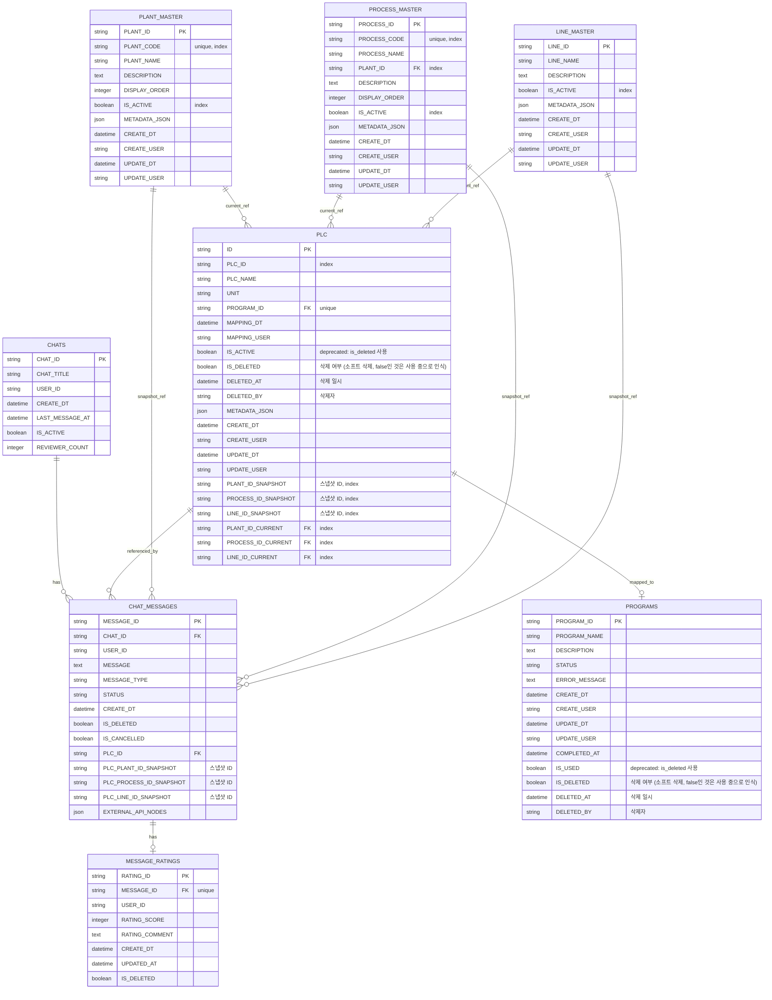

# PLC 계층 구조 테이블 ERD

## 전체 ERD 다이어그램

## 주요 관계 설명

### 1. 채팅 관련
- **CHATS** ↔ **CHAT_MESSAGES**: 1:N (한 채팅방에 여러 메시지)
- **CHAT_MESSAGES** ↔ **MESSAGE_RATINGS**: 1:1 (메시지당 평가 1개)

### 2. PLC 계층 구조
- **PLANT_MASTER**, **PROCESS_MASTER**, **LINE_MASTER**: 독립적인 마스터 테이블 (서로 종속 관계 없음)
- **PLC** 테이블이 모든 마스터를 FK로 참조하여 계층 구조 구성

### 3. PLC와 Master 테이블
- **PLC.current 참조**: FK로 연결 (현재 기준정보 참조)
  - `PLANT_ID_CURRENT` → `PLANT_MASTER.PLANT_ID`
  - `PROCESS_ID_CURRENT` → `PROCESS_MASTER.PROCESS_ID`
  - `LINE_ID_CURRENT` → `LINE_MASTER.LINE_ID`

- **PLC.snapshot**: ID만 저장 (FK 없음, 불변 스냅샷)
  - `PLANT_ID_SNAPSHOT` (논리적 참조)
  - `PROCESS_ID_SNAPSHOT` (논리적 참조)
  - `LINE_ID_SNAPSHOT` (논리적 참조)

### 4. ChatMessage와 Master 테이블
- **CHAT_MESSAGES.snapshot**: ID만 저장 (FK 없음, 메시지 생성 시점의 계층 구조 보존)
  - `PLC_PLANT_ID_SNAPSHOT` (논리적 참조)
  - `PLC_PROCESS_ID_SNAPSHOT` (논리적 참조)
  - `PLC_LINE_ID_SNAPSHOT` (논리적 참조)

## 데이터 흐름

### 메시지 생성 시
1. `CHAT_MESSAGES` 생성
2. `PLC_ID`로 PLC 조회
3. PLC의 `*_SNAPSHOT` 필드에서 ID 추출
4. `CHAT_MESSAGES`의 `PLC_*_ID_SNAPSHOT` 필드에 저장

### 메시지 조회 시
1. `CHAT_MESSAGES` 조회
2. `PLC_*_ID_SNAPSHOT` 필드에서 ID 추출
3. Master 테이블에서 조인하여 code, name 조회
4. 계층 구조 정보 반환

## 설계 특징

1. **스냅샷은 ID만 저장**: code, name은 master 테이블에서 조인으로 조회
2. **FK는 current만**: snapshot은 불변이므로 FK 없음
3. **과거 데이터 보존**: ChatMessage의 스냅샷으로 생성 시점의 계층 구조 보존
4. **PLC Hierarchy는 수정 불가**: 한번 입력된 PLC의 hierarchy는 수정되지 않음

